# 8 Puzzle Game Solver

## Table Of Contents

- [User Instructions](#subheading-1)
- [User Interface](#subheading-2)
- [Algorithms Overview](#subheading-3)
  - [DFS](#subheading-1)
  - [IDS (Iterative deepening search)](#subheading-3)
  - [BFS (Breadth-First Search)](#subheading-2)
  - [A\* (A-Star Search)](#subheading-4)
- [Test Cases](#subheading-4)

  ## Students

  - Moustafa Esam El-Sayed Amer - 21011364
  - Mahmoud Abdelghany Darwish Ads - 21011275
  - Ahmed Mostafa Elmorsi Amer - 21010189

  ## [**_GitHub Repo Link_**](https://github.com/MoustafaAmer12/8-Puzzle-Game.git)

## User Instructions

### To run the application follow these steps:

1. Clone or download the project, including the requirements.txt file.
2. Open their terminal and navigate to the project directory.
3. Create and activate a new virtual environment using the following

```

python3 -m venv venv

```

For Linux

```

source venv/bin/activate

```

For Windows

```

venv\Scripts\activate

```

**After Activating the virtual environment** 4. Download the required dependencies using

```

pip install -r requirements.txt

```

5. Run the main.py file using

```

python3 -m main

```

## User Interface

### Overview

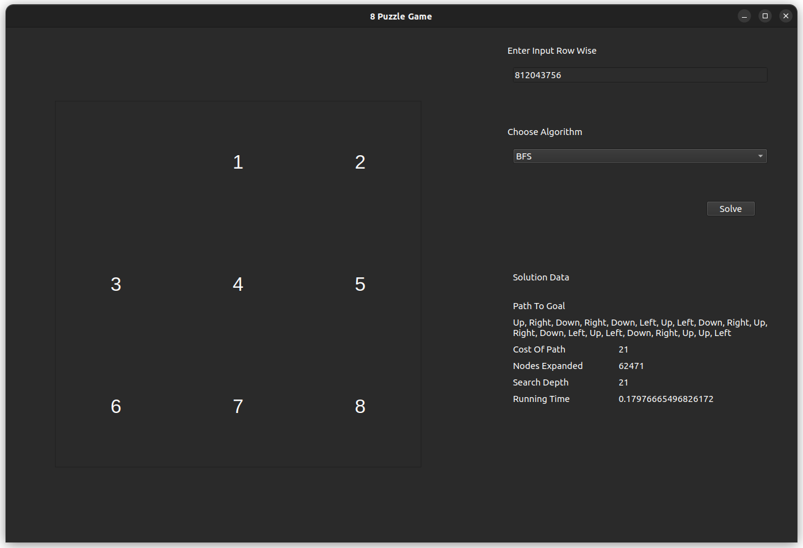

- The GUI consists of 2 components
  - The first part is the Grid that is animated with smooth transitions, to show how the steps to the solution are proceeded.
  - The second is the side layout which consists of an input controller, with a choice for algorithm and a display for the output of the algorithm.
  - The output of the algorithm is also displayed in the terminal.
  - The input is set in a row-wise format of the grid in the input box.

## Algorithms Overview

### DFS (Depth First Search)

#### Data Structures

1. Parent map → to record each node with its parent so we can construct path
2. Depth map → to record expanded nodes Depth which will help us to get cost of goal and Max search Depth
3. Explored set → helps me to discard pre-expanded nodes
4. Frontier list (used as a stack) → to store nodes to be expanded
5. Also, Strings were used to handle zero padding of the state and used lists in generate children function as it is strings are immutable.

#### Explanation

- Since the frontier is a stack the expanded nodes are generated with deepest to shallowest nodes style . algorithm will go as deep as it can then backtrack and try another branch of the search tree.
- This approach is not optimal but memory efficient and it is complete if max search depth is finite
- Time Complexity is _O(b^m^)_ and Space complexity is _O(b\*m)_ (Where b is branching factor in this problem is 4 and m is max search Depth).

#### Steps

- My Algorithm starts with an initial state then pushes it in frontier and explored set and sets the Depth of it as 0 and parent as -1 (special value to help me constructing path)
- Then it keep going until frontier is empty taking a node from frontier and expand it(do the goal test on it and gets its children into frontier)
- When adding nodes to frontier , i check if the node is in frontier before or expanded before if so i discard the node
- Then the Parent map and Depth map values of node were adjusted

### IDS (Iterative deepening search)

#### Data Structures

1. Parent map → to record each node with its parent so we can construct path
2. Depth map → to record expanded nodes Depth which will help us to get cost of goal and Max search Depth
3. Explored set → helps me to discard pre-expanded nodes
4. Frontier list (used as a stack) → to store nodes to be expanded
5. Strings also were used to handle zero padding of the state and used lists in generate children function as it is strings are immutable.

#### Explanation

- It is simply a DFS but with a Depth limit increased until the goal is captured.
- Since the frontier is a stack the expanded nodes are generated with deepest to shallowest nodes style . algorithm will go as deep as it can then backtrack and try another branch of the search tree
- This approach is optimal and memory efficient and it is complete if goal depth is finite
- Time Complexity is _O(b^d^)_ and Space complexity is *O(b*d)\* combines the goodness of both DFS and BFS(Where b is branching factor in this problem is 4 and d is goal Depth)

#### Steps

- These steps are done from depth 0 to d(depth of goal)
- The Algorithm starts with an initial state then pushes it in frontier and explored set and sets the Depth of it as 0 and parent as -1 (special value to help me constructing path).
- Then it keep going until frontier is empty taking a node from frontier and expand it(do the goal test on it and gets its children into frontier.
- When adding nodes to frontier , i check if the node is in frontier before or expanded before if so i discard the node.
  **_Note_** Why is this happening ? The DFS nature of proceeding to the deepest level first makes it leave a node at lower level and proceed to deep levels . it may found it in the deeper level but it will generate wrong output if this node is part of the shortest path to goal due to optimal sub-structure property of the shortest paths so i need all nodes to be found in their lowest possible level of occurrence.
- But if the node is in frontier or explored before but i discovered it with less depth than it was before , i update its depth map and parent map and add it to frontier again

### BFS (Breadth-First Search)

#### Data Structures

1. Parent Map → Records each node's parent, which helps in reconstructing the solution path once the goal is found.
2. Depth Map → Tracks the depth of each expanded node, aiding in calculating the maximum search depth and cost to the goal.
3. Explored Set → Keeps track of nodes that have already been expanded to avoid reprocessing.
4. Frontier Queue (FIFO) → Maintains nodes that are waiting to be expanded, following a first-in, first-out (FIFO) order to ensure level-by-level exploration.

#### Explanation

- Since the frontier is a queue, BFS expands nodes in a level-order fashion, exploring all nodes at a given depth before moving deeper. This approach ensures that the first solution found is the optimal one (i.e., it minimizes the number of moves from the initial state to the goal). While BFS is complete (it will find a solution if one exists), it has high memory requirements due to the need to store all nodes at each depth level.
- Time Complexity: _O(b\*d)_ and Space Complexity: _O(b\*d)_, where b is the branching factor (4 in this case) and d is the depth of the shallowest solution.

#### Steps

- Initialize the frontier with the initial state, setting its depth as 0 and parent as None.
- While the frontier is not empty:
  - Dequeue the node from the frontier.
  - Perform a goal test on the current node.
- If it is the goal, reconstruct the path using the parent map and return the solution. Otherwise, expand the current node to generate its neighbors.
- For each neighbor,
  - If the neighbor hasn’t been visited:
    - Add it to the explored set, set its parent, depth, and add it to the frontier queue.
    - Repeat until the goal is found or the frontier is empty (in which case, no solution exists).

### A\* (A-Star Search)

#### Data Structures

1. Parent Map → Tracks each node's parent for reconstructing the optimal path once the goal is reached.
2. Depth Map → Maintains the depth of each node, which aids in calculating the path cost to the goal.
3. Explored Set → Helps keep track of the nodes that have been expanded and their best-known costs to avoid redundant expansions.
4. Priority Queue (Min-Heap) → Stores nodes prioritized by their total cost (actual cost from the start to the node + estimated cost to the goal). Ensures the node with the lowest cost is expanded first.

#### Explanation

- A* search uses a priority queue to prioritize nodes based on their estimated total cost (combining path cost and heuristic estimate). The heuristic function (e.g., Manhattan or Euclidean distance) estimates the remaining cost from the current node to the goal. A* is both complete and optimal when the heuristic is admissible (never overestimates the cost), making it highly efficient for finding the shortest path.
- Time Complexity: Depends on the quality of the heuristic, but in the worst case, it’s similar to BFS: _O(b\*d)_. Space Complexity: Also _O(b\*d)_ due to storing nodes in memory.

#### Steps

- Initialize the priority queue with the initial state, setting its depth as 0, parent as None, and calculating its heuristic cost.
- While the priority queue is not empty:
  - Pop the node with the lowest cost from the queue.
  - Perform a goal test on the current node.
  - If it is the goal, reconstruct the path using the parent map and return the solution. Otherwise, expand the current node to generate its neighbors.
    - For each neighbor:
      - Calculate the total cost (current path cost + heuristic cost to the goal).
      - If the neighbor has not been explored or is found with a lower cost, update its parent, depth, and cost in the priority queue.
  - Continue until the goal is reached or no more nodes are in the priority queue, indicating no solution.

#### Heuristics

- **Manhattan Vs Euclidean Heuristic Comparison**
  - For the 8-puzzle problem, the Manhattan Distance heuristic is expected to perform better than Euclidean Distance due to its direct correlation with possible moves. This alignment makes Manhattan a more admissible heuristic, as it provides a more accurate estimate of moves required without overestimating, which would otherwise cause unnecessary node expansions. In contrast, Euclidean Distance, by including diagonals, overestimates in this grid-restricted problem, leading to additional expansions and potential inefficiency.
  - Expected Outcome:
    - Nodes Expanded: Manhattan heuristic should result in fewer nodes expanded due to its closer alignment with the 8-puzzle’s move set.
    - Path Efficiency: Manhattan’s estimate is expected to lead to a more optimal path cost in terms of moves, further validating its admissibility.
- Admissibility Conclusion: Manhattan heuristic is more admissible and efficient for the 8-puzzle problem, as it provides a cost-effective, realistic estimate directly aligned with the problem constraints.

## Test Cases

### Test Case 1

The test case is for the input _812043756_, which is solvable with an optimal of 21 steps.

- BFS
  
- IDS
  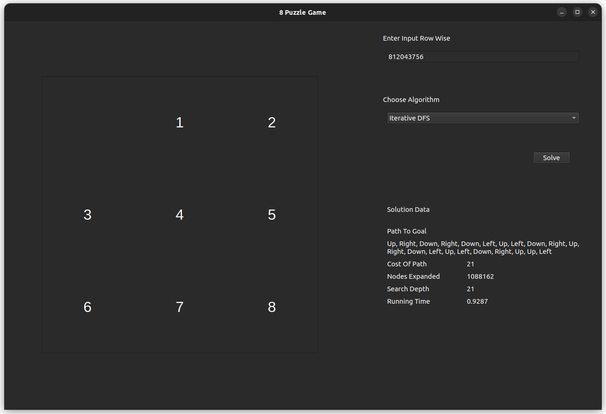
- A* Using Manhattan Heuristic
  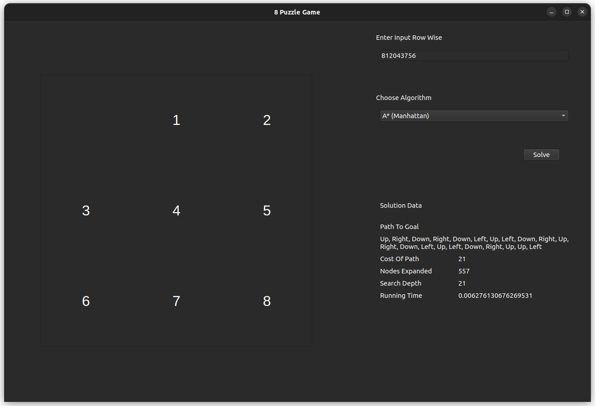
- A* Using Euclidean Heuristic
  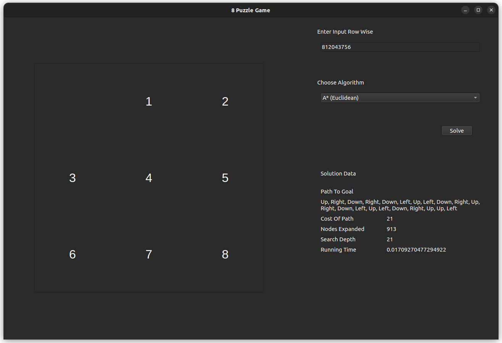

### Test Case 2

The test case is for the input _125348670_, which is solvable with an optimal of 4 steps.

- BFS
  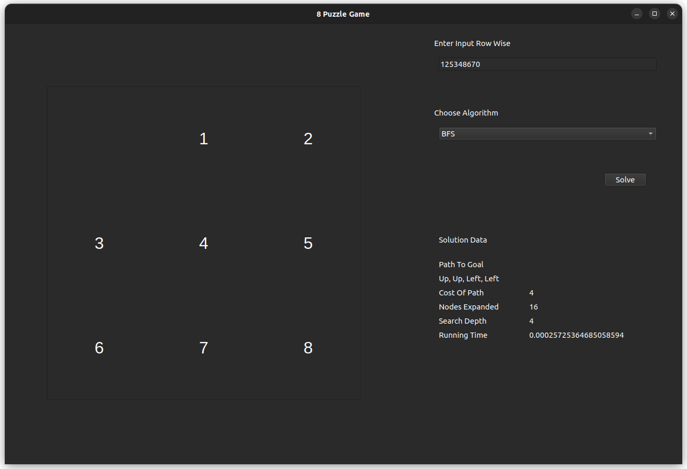
- IDS
  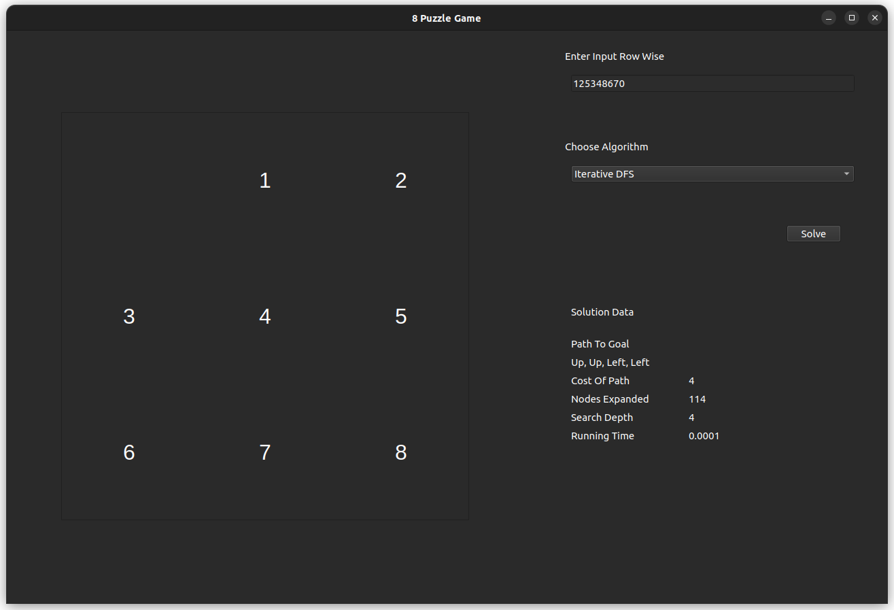
- A* Using Manhattan Heuristic
  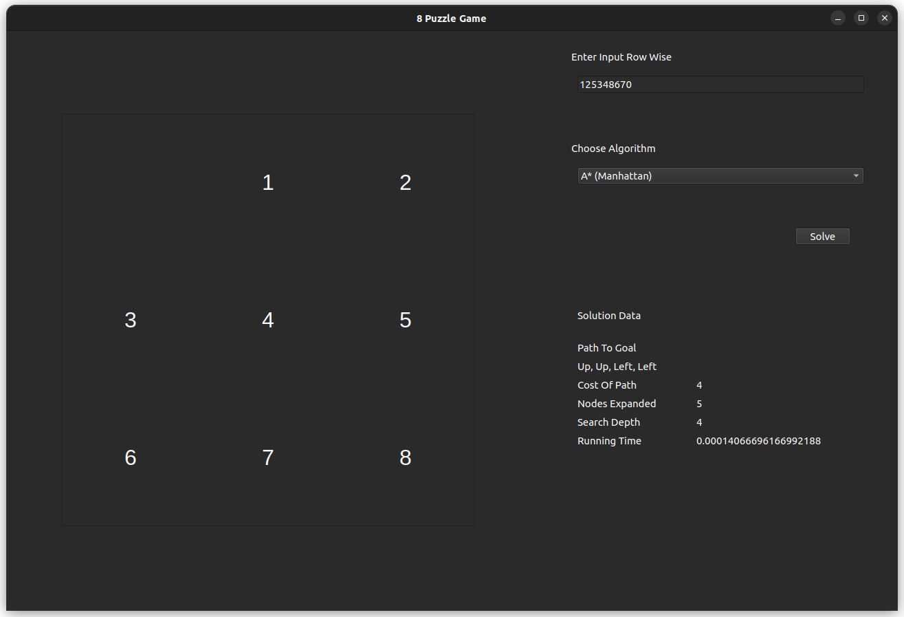
- A* Using Euclidean Heuristic
  
- DFS
  

### Test Case 3

The test case is for the input _812043756_, which is solvable with an optimal of 20 steps.

- BFS
  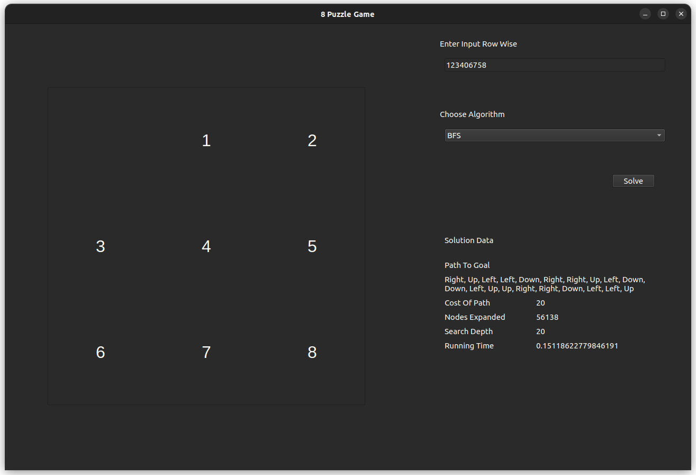
- IDS
  
- A* Using Manhattan Heuristic
  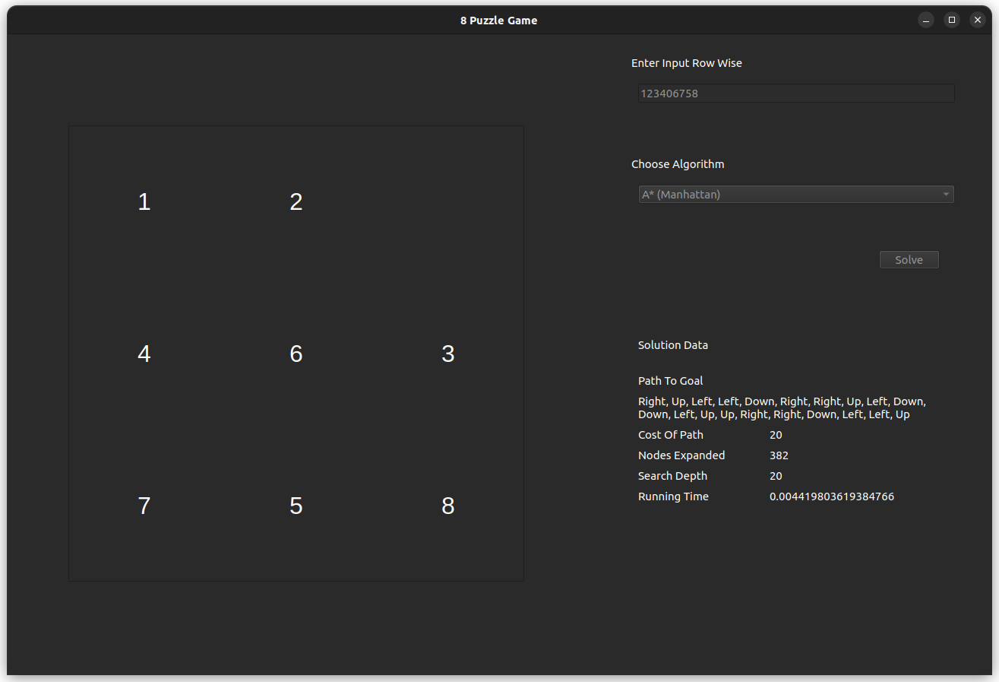
- A* Using Euclidean Heuristic
  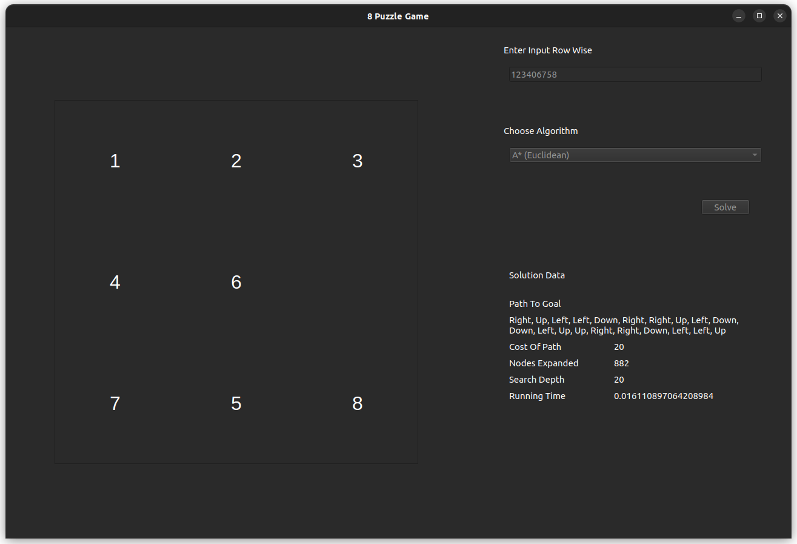
- DFS
  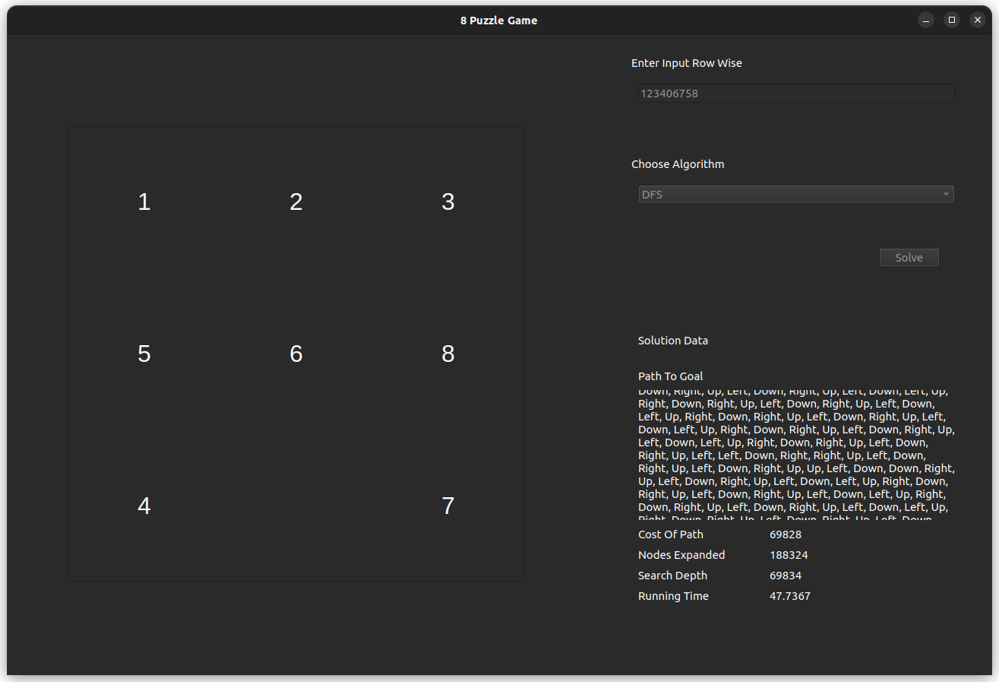

### Test Case 4

The test case is meant for an unsolvable state, with an odd number of inversions.
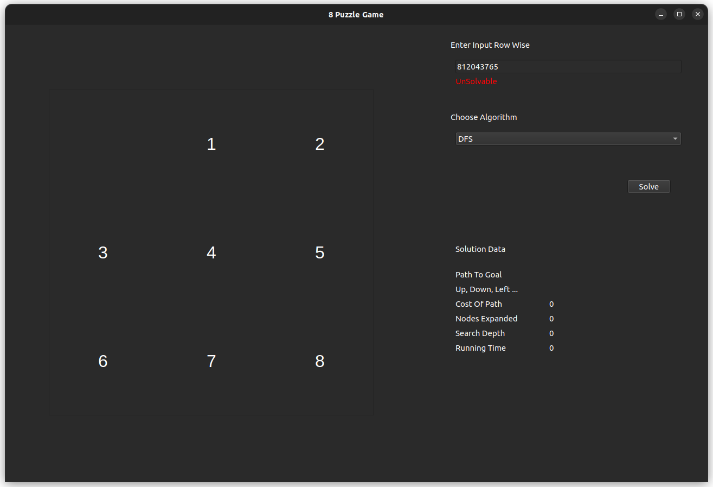

- ### **_Conclusion_**
  For the _8-puzzle-game_, each of the search algorithms yields different results in terms of optimality, memory usage and speed.
  - _DFS_, is found to be eligible, however it is not optimal and it provides a slow but correct solution.
  - _BFS_, is found to be optimal and faster than DFS, however its memory consumption is noticed to be very high.
  - _IDS_, is found to be optimal and faster in comparison to DFS, however, its memory consumption is noticable.
  - _A\* Using Manhattan Heuristic_, is optimal and relatively fast, with fewer nodes exploration in comparison with BFS.
  - _A\* Using Euclidean Heristic_, is also optimal, but slower in comparison to the Manhattan Heuristic and less efficient.
